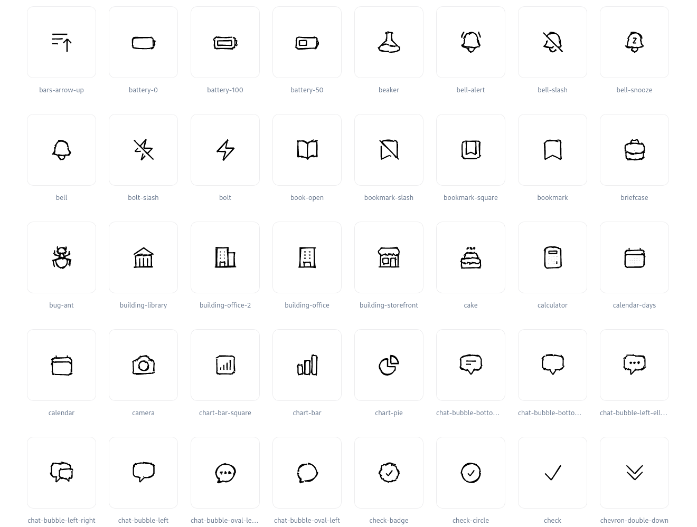

# roughlify

Make your SVG rough ([❤️ rough.js](https://roughjs.com/)).



<p align="center">Example with <a href="https://heroicons.com/">heroicons</a></p>
<p></p>

## Installation

```shell
yarn global add roughlify
```

## Usage

You can either provide a SVG or HTML file (local or remote). In the HTML case, it will make all the svg rough.

```shell
roughlify --stroke "#3500d3" --fill "#3500d3" examples/truck.svg
```

| Before                           | After                                  |
| -------------------------------- | -------------------------------------- |
|  |  |

Currently `roughlify` follows the [`rough.js` options](https://github.com/rough-stuff/rough/wiki#options) through CLI flags.
